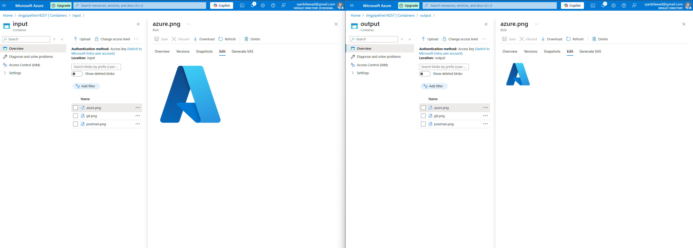

<h1>Image Processing Pipeline (Azure + Kubernetes + CI/CD)</h1>

A fully automated, serverless-to-Kubernetes pipeline that processes uploaded images. Built using Azure Functions, Azure Blob Storage, Azure Service Bus, Azure Kubernetes Service (AKS), Docker, GitHub Actions, and KEDA.

<h2>🚀 Project Overview</h2>

<ul>
<li>Upload an image to Azure Blob Storage (input container).</li>
<li>Azure Function triggers on upload and sends a message to Azure Service Bus.</li>
<li>KEDA detects the Service Bus message and scales Kubernetes deployment accordingly.</li>
<li>Containerized processor app pulls the image, resizes it to 100x100 pixels, and uploads it to the output container.</li>
<li>CI/CD pipeline via GitHub Actions handles automatic image builds, pushes, and deployment restarts.</li>
</ul>

<h2>🛠️ Technologies Used</h2>

| Category | Technology |
|:---|:---|
| ☁️ Cloud | **Azure Blob Storage**, **Azure Service Bus**, **Azure Kubernetes Service (AKS)** |
| ⚡ Serverless | **Azure Functions** |
| 📦 Containers | **Docker**, **DockerHub** |
| 📈 Scaling | **KEDA (Kubernetes Event-Driven Autoscaling)** |
| 🐍 Backend | **Python** with **Pillow** for image processing and **Azure SDKs** (`azure-storage-blob`, `azure-servicebus`) |
| 🔁 CI/CD | **GitHub Actions** for building Docker images and updating Kubernetes deployments |

<h2>📂 Repository Structure</h2>

<pre><code>
.
├── .github/
│   └── workflows/
│       └── ci-cd-pipeline.yml
├── azure-function/
│   ├── myblobtrigger/
│   │   ├── __init__.py
│   │   └── function.json
│   ├── host.json
│   ├── local.settings.json
│   ├── requirements.txt
├── k8s-processor/
│   ├── Dockerfile
│   ├── processor.py
│   ├── requirements.txt
├── k8s/
│   ├── deployment.yaml
│   ├── scaledobject.yaml
│   ├── job-template.yaml (optional for manual testing)
├── README.md
</code></pre>

<h2>🔧 Setup and Deployment Instructions</h2>

<h3>1. Azure Resource Setup</h3>
<ol>
<li>Create a Resource Group in Azure.</li>
<li>Provision:
  <ul>
    <li>Azure Storage Account (with input/output blob containers)</li>
    <li>Azure Service Bus (Namespace + Queue)</li>
    <li>Azure Kubernetes Service (AKS) Cluster</li>
    <li>Azure Function App (Python 3.9, Consumption Plan)</li>
  </ul>
</li>
</ol>

<h3>2. Function App Setup</h3>
<ol>
<li>Deploy the Azure Function from <code>azure-function/</code> using Azure Functions Core Tools:
<pre><code>func azure functionapp publish &lt;your-function-app-name&gt;</code></pre>
</li>
<li>Set Application Settings:
  <ul>
    <li><code>AzureWebJobsStorage</code>: Storage Account connection string</li>
    <li><code>ServiceBusConnectionString</code>: Service Bus connection string</li>
    <li><code>QueueName</code>: Your queue name</li>
  </ul>
</li>
</ol>

<h3>3. Kubernetes Setup</h3>
<ol>
<li>Create Kubernetes Secrets for storage and service bus:
<pre><code>
kubectl create secret generic storage-secret --from-literal=connectionString="&lt;your-storage-connection-string&gt;"
kubectl create secret generic servicebus-secret --from-literal=connectionString="&lt;your-servicebus-connection-string&gt;"
</code></pre>
</li>

<li>Deploy KEDA:
<pre><code>
kubectl create namespace keda
helm repo add kedacore https://kedacore.github.io/charts
helm repo update
helm install keda kedacore/keda --namespace keda
</code></pre>
</li>

<li>Deploy Processor Deployment and ScaledObject:
<pre><code>
kubectl apply -f k8s/deployment.yaml
kubectl apply -f k8s/scaledobject.yaml
</code></pre>
</li>
</ol>

<h3>4. Docker Image Build and Push</h3>
<ol>
<li>Build and push the latest Docker image:
<pre><code>
docker build -t &lt;your-dockerhub-username&gt;/k8s-processor:latest ./k8s-processor
docker push &lt;your-dockerhub-username&gt;/k8s-processor:latest
</code></pre>
</li>
</ol>

<h3>5. GitHub Actions CI/CD Setup</h3>
<ol>
<li>Add GitHub Secrets:
  <ul>
    <li>DOCKERHUB_USERNAME</li>
    <li>DOCKERHUB_TOKEN</li>
    <li>AZURE_CREDENTIALS (Generated via <code>az ad sp create-for-rbac --sdk-auth</code>)</li>
    <li>AKS_RESOURCE_GROUP</li>
    <li>AKS_CLUSTER_NAME</li>
  </ul>
</li>
<li>CI/CD Workflow (<code>.github/workflows/ci-cd-pipeline.yml</code>) automatically:
  <ul>
    <li>Builds Docker image</li>
    <li>Pushes to DockerHub</li>
    <li>Fetches AKS credentials</li>
    <li>Restarts Kubernetes Deployment to pick up latest image</li>
  </ul>
</li>
</ol>

<h2>📸 Example Workflow</h2>

<ol>
<li>Upload an image to the "input" container in Azure Blob Storage.</li>
<li>Azure Function triggers and sends message to Service Bus.</li>
<li>KEDA scales the Kubernetes Deployment automatically based on queue length.</li>
<li>Processor pod downloads the image, resizes it, and uploads it to "output" container.</li>
</ol>

<h2>✅ Features</h2>

<ul>
<li>Fully serverless-triggered Kubernetes pipeline</li>
<li>Handles any image dynamically (no hardcoded filenames)</li>
<li>Supports PNG, JPEG, and other formats (automatic RGBA to RGB conversion)</li>
<li>Auto-scaled Kubernetes pods using KEDA</li>
<li>CI/CD fully automated with GitHub Actions</li>
</ul>

## 👨‍💻 Author

Built with chai and code by [Syed Fawad]
